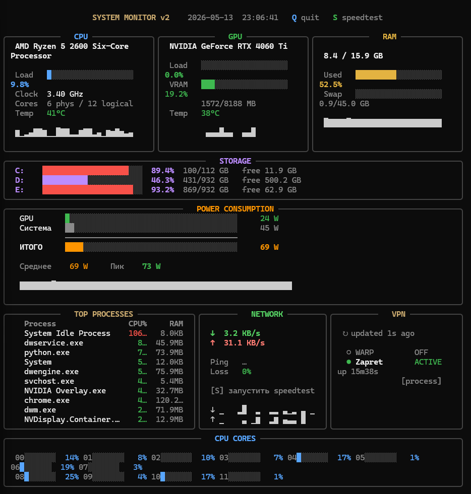

<div align="center">

<h1>
  
  SYSMON
</h1>

**Real-time terminal system monitor for Windows**

[](https://python.org)
[](#)
[](LICENSE)
[](https://github.com/DezertTwin/sysmon/stargazers)
[](https://github.com/DezertTwin/sysmon/issues)

🇷🇺 [Русская документация](README_RU.md)

</div>

---

<div align="center">



</div>

---

## Overview

**SYSMON** is a lightweight, dependency-minimal terminal dashboard that shows everything about your system in one screen — CPU, GPU, RAM, disks, network, power consumption, VPN status and top processes. Built with [Rich](https://github.com/Textualize/rich), refreshes at 2 FPS, zero overhead.

The color theme is inspired by Claude's dark UI palette.

---

## Features

| Module | What you get |
|--------|-------------|
| **CPU** | Load %, clock speed, temperature, power draw, per-core bars, sparkline history |
| **GPU** | Load %, VRAM usage, temperature, power draw (NVIDIA via GPUtil or nvidia-smi) |
| **RAM** | Usage bar, swap, sparkline history |
| **Storage** | Usage per partition, I/O read/write speed |
| **Network** | Download/upload speed, ping to 8.8.8.8, packet loss, built-in speedtest |
| **Power** | CPU + GPU + system watts, rolling average and peak tracking |
| **VPN** | Cloudflare WARP and Zapret / GoodbyeDPI detection (process + service) |
| **Processes** | Top 10 by CPU, with RAM column |

### Keyboard Shortcuts

| Key | Action |
|-----|--------|
| `Q` | Quit |
| `S` | Run internet speedtest |

---

## Requirements

- **Windows 10 / 11**
- **Python 3.8+**
- For CPU temperature & power readings: [OpenHardwareMonitor](https://openhardwaremonitor.org/) or [LibreHardwareMonitor](https://github.com/LibreHardwareMonitor/LibreHardwareMonitor) must be running

---

## Installation

```bash
# 1. Clone
git clone https://github.com/DezertTwin/sysmon.git
cd sysmon

# 2. Install dependencies
pip install -r requirements.txt

# 3. Launch
py sysmon.py
```

### Desktop Shortcut (optional)

```powershell
powershell -ExecutionPolicy Bypass -File install_shortcut.ps1
```

Creates a **System Monitor** shortcut on your Desktop that launches the dashboard in a terminal window.

---

## Dependencies

```
rich >= 13.0        # terminal UI
psutil >= 5.9       # CPU / RAM / disk / network metrics
GPUtil >= 1.4       # NVIDIA GPU load & VRAM  (optional)
wmi >= 1.5.1        # Windows hardware sensors (optional)
speedtest-cli       # internet speed test
```

Install all at once:
```bash
pip install -r requirements.txt
```

---

## GPU & Temperature Notes

| Feature | What's needed |
|---------|--------------|
| CPU temperature | OpenHardwareMonitor or LibreHardwareMonitor running |
| CPU power draw | OpenHardwareMonitor or LibreHardwareMonitor running |
| GPU load & VRAM | `GPUtil` package + NVIDIA drivers |
| GPU temperature | OpenHardwareMonitor / LibreHardwareMonitor |
| GPU power draw | `nvidia-smi` (bundled with NVIDIA drivers) or OHM/LHM |

The app works without any of the above — missing metrics are shown as `—`.

---

## VPN Detection

SYSMON detects:
- **Cloudflare WARP** — via `warp-cli status` or network interface name
- **Zapret / GoodbyeDPI / winws** — via running process names and Windows services

Detection updates every **3 seconds**. Ping to `1.1.1.1` is measured every 8 seconds when WARP is active.

---

## License

MIT © 2026 [DezertTwin](https://github.com/DezertTwin)
